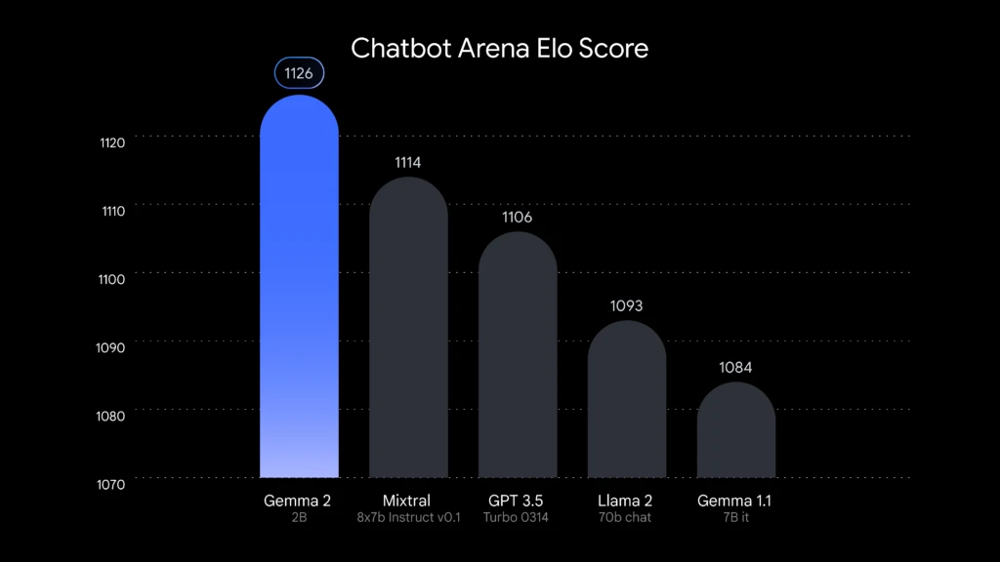

# gemma2_finetuning_ko
Gemma는 Google의 경량화된 최첨단 오픈 모델 패밀리로, Gemini 모델을 만드는 데 사용된 동일한 연구와 기술을 기반으로 구축되었습니다. 이 모델들은 텍스트-투-텍스트 방식의 디코더 전용 대규모 언어 모델로, 영어로 제공되며, 사전 훈련된 변형과 지침 조정 변형 모두에 대한 오픈 가중치를 제공합니다. Gemma 모델은 질문 응답, 요약 및 추론 등 다양한 텍스트 생성 작업에 적합합니다. 상대적으로 작은 크기로 인해 노트북, 데스크톱 또는 개인 클라우드 인프라와 같은 제한된 리소스 환경에서도 배포할 수 있어 최첨단 AI 모델에 대한 접근성을 민주화하고 모두를 위한 혁신을 촉진하는 데 도움을 줍니다.



### Gemma Prompt
```python
word = r'''
<bos><start_of_turn>user
Write a hello world program<end_of_turn>
<start_of_turn>model
'''
```
- \<bos>： Beginning of sequence
- <start_of_turn> ： 시작 구분 기호
- <end_of_turn> : 종료 구분 기호

### 프로젝트 참가자 
| 이름   |    깃허브 아이디    | 깃허브 
|--------|---------------------|
| 김강우 |      kimkangwoo     |https://github.com/kimkangwoo
| 손병진 |    SonByeongJin     |https://github.com/SonByeongJin
| 김민석 |        428KMS       |https://github.com/428KMS

<br><br>
---

### BASE_Model : google/gemma-2-2b-it
- google/gemma-2-2b-it : `https://huggingface.co/google/gemma-2-2b-it`

### Dataset : 
- 한국어 데이터셋 : `https://huggingface.co/datasets/nlpai-lab/kullm-v2`

- 저음질 전화망 음성인식 데이터 : `https://www.aihub.or.kr/aihubdata/data/view.do?currMenu=115&topMenu=100&dataSetSn=571`
    - 사용한 데이터 셋 : 
        1. `dataset/1.Training/라벨링데이터_230316/D02/J05`
            - Training 데이터에서 창원시, 전주시 민원 데이터 중 복지 데이터 
        2. `dataset/2.Validation/라벨링데이터_230316/D02/J05`
            - Validation 데이터에서 창원시, 전주시 민원 데이터 중 복지 데이터 